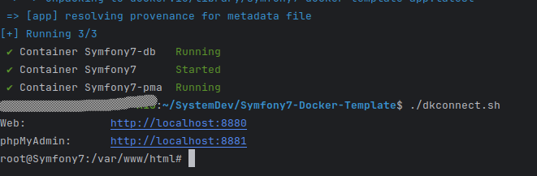

# Symfony7 Docker Template

This project is a starter project for building a Symfony application using Docker.

You can follow the tutorial for it
here [https://kumoitech.xyz/blog/how-to-start-a-symfony-7-application-with-docker-without-having-php-locally-installed-on-your-machine](https://kumoitech.xyz/blog/how-to-start-a-symfony-7-application-with-docker-without-having-php-locally-installed-on-your-machine).

## Getting Started

1. Start by creating a new repository based on the *Symfony7 Docker Template* on *[GitHub](https://github.com)*.
2. Clone the new repository on your computer and open it in your favourite editor or IDE to get started.
3. Open the file `docker.env` and customize any of the environment variables to your needs. You may change the `DC_*`
   values in order to avoid container conflicts with already running containers.

    ```shell
    # Container name for the app service in docker-compose.yaml, must be unique for all containers running on your docker instance
    DC_APP_NAME=Symfony7
    # Forwarded port for the Symfony7 app service
    DC_APP_PORT=8880
    # Forwarded port for phpMyAdmin service to view the underlying application database
    DC_PMA_PORT=8881
    # MySQL credentials - username
    MYSQL_USER=app_development
    # MySQL credentials - password
    MYSQL_PASSWORD=password
    # MySQL credentials - database
    MYSQL_DATABASE=app_db
    ``` 

4. Once you have successfully configured your app via the `docker.env` file, run the `./dkbuild.sh` file to build your
   container images and run the application.
5. Next, run `./dkconnect.sh` to connect to the `app` service container where the *Symfony7* application is running.

   

6. Run `symfony composer install` to install the application and it's dependencies.

   

## Where to Next?

Congratulations for getting to this point.